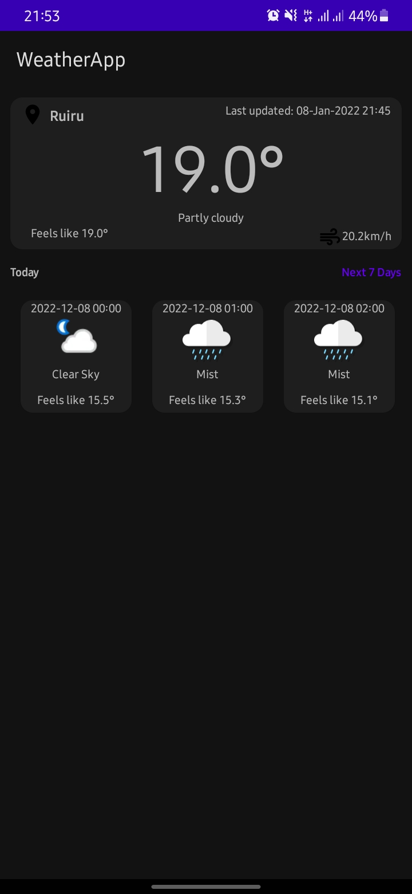

## Weather App
- An android app that consumes the [Weather API](https://www.weatherapi.com/). It displays the current weather, and the day's forecast.
- The gaol of the project was to practise the Model-view-Viewmodel pattern with clean architecture.

###  Get Started
- Head on to - Go to https://www.weatherapi.com/
- Sign up with free plan
- In your gradle.properties, add the following line at the bottom of the file;
- API_KEY = "Your key goes here"
- Ensure you've added gradle.properties to your .gitignore.

## Screenshots



## Technology Stack
- [Kotlin](https://kotlinlang.org/) - First class and official programming language for Android development.
- [Coroutines](https://kotlinlang.org/docs/reference/coroutines-overview.html) - To improve performance and overall user experience.
- [Android Architecture Components](https://developer.android.com/topic/libraries/architecture) - Collection of libraries that help you design robust, testable, and maintainable apps.
  - [LiveData](https://developer.android.com/topic/libraries/architecture/livedata) - Data objects that notify views when the underlying database changes.
  - [ViewModel](https://developer.android.com/topic/libraries/architecture/viewmodel) - Stores UI-related data that isn't destroyed on UI changes.
  - [ViewBinding](https://developer.android.com/topic/libraries/view-binding) - Generates a binding class for each XML layout file present in that module and allows you to more easily write code that interacts with views.

- [Dagger-Hilt](https://dagger.dev/hilt/) For [Dependency injection (DI)](https://developer.android.com/training/dependency-injection)
- [Material Components for Android](https://github.com/material-components/material-components-android) - Modular and customizable Material Design UI components for Android.
- [Retrofit](https://square.github.io/retrofit/) - To make network calls.

```
Copyright 2022 The Android Open Source Project

Licensed under the Apache License, Version 2.0 (the "License");
you may not use this file except in compliance with the License.
You may obtain a copy of the License at

    https://www.apache.org/licenses/LICENSE-2.0

Unless required by applicable law or agreed to in writing, software
distributed under the License is distributed on an "AS IS" BASIS,
WITHOUT WARRANTIES OR CONDITIONS OF ANY KIND, either express or implied.
See the License for the specific language governing permissions and
limitations under the License.
```

